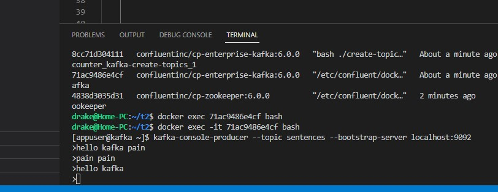
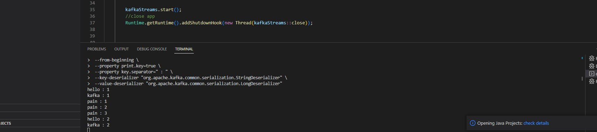

## Kafka streams simplest app
* get this example from here 
[kafkastreams](https://www.youtube.com/watch?v=MR5hllNC9hk&list=PL7dZNxCsTH8fCJwRiWKyED-CLKDtZl08-&index=1)
* main functionality:
  * get words from *sentences* topic
  * flat, group and count words
  * return back to *word-count* topic
* app topology

* main code is in [wordcountApp](wcounter/src/main/java/com/programming/wordcount/WordcountApp.java)
* results

